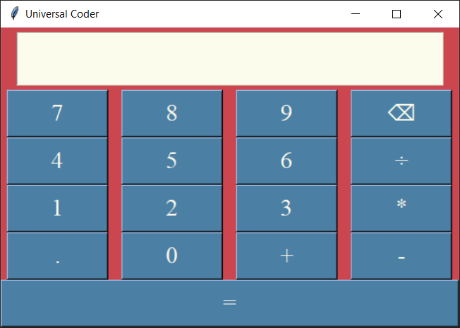

# Calculator-Python-GUI

Hello, 
 
 This project is on a Calculator using Python GUI.
 
📌Features:-

1. Additon

2. Subraction

3. Multiplication

4. Division

5. Decimal Points

6. Delete

I hope you like it. 
 
 Thank you !!
 
 # *Output :-*

 # *Contact Us :-*

|[Instagram](https://instagram.com/universal_coder)|[Twitter](https://twitter.com/LondheAaryan)|[Linkedin](https://www.linkedin.com/in/aaryan-r-londhe-0a1809179/)|
|-|-|-|

